* Table of Contents
{:toc}

--------------------------------------------------------------------------------------------------------------------

## **Acknowledgements**

* This project is adapted from the se-edu AddressBook Level 3 codebase and documentation style: <https://github.com/se-edu/addressbook-level3>.
* UI architecture and testing conventions also reference se-edu guides: <https://se-education.org/guides/>.

--------------------------------------------------------------------------------------------------------------------

## **Setting up, getting started**

Refer to the guide [_Setting up and getting started_](SettingUp.md).

--------------------------------------------------------------------------------------------------------------------

## **Design**

:bulb: **Tip:** The `.puml` files used to create diagrams are in this document `docs/diagrams` folder. Refer to the [_PlantUML Tutorial_ at se-edu/guides](https://se-education.org/guides/tutorials/plantUml.html) to learn how to create and edit diagrams.

### Architecture

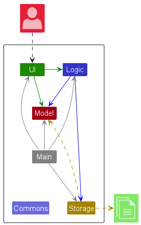

The ***Architecture Diagram*** given above explains the high-level design of the App.

Given below is a quick overview of main components and how they interact with each other.

**Main components of the architecture**

**`Main`** (consisting of classes [`Main`](https://github.com/AY2526S2-CS2103T-W13-4/tp/tree/master/src/main/java/seedu/coursepilot/Main.java) and [`MainApp`](https://github.com/AY2526S2-CS2103T-W13-4/tp/tree/master/src/main/java/seedu/coursepilot/MainApp.java)) is in charge of the app launch and shut down.
* At app launch, it initializes the other components in the correct sequence, and connects them up with each other.
* At shut down, it shuts down the other components and invokes cleanup methods where necessary.

The bulk of the app's work is done by the following four components:

* [**`UI`**](#ui-component): The UI of the App.
* [**`Logic`**](#logic-component): The command executor.
* [**`Model`**](#model-component): Holds the data of the App in memory.
* [**`Storage`**](#storage-component): Reads data from, and writes data to, the hard disk.

[**`Commons`**](#common-classes) represents a collection of classes used by multiple other components.

**How the architecture components interact with each other**

The *Sequence Diagram* below shows how the components interact with each other for the scenario where the user issues the command `delete -student 1`.

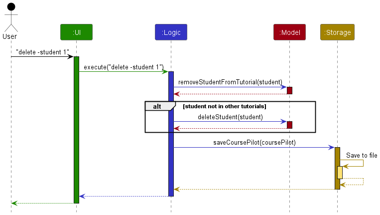

Each of the four main components (also shown in the diagram above),

* defines its *API* in an `interface` with the same name as the Component.
* implements its functionality using a concrete `*Manager` class (e.g., `LogicManager`, `ModelManager`) which follows the corresponding API `interface` mentioned in the previous point.

For example, the `Logic` component defines its API in the `Logic.java` interface and implements its functionality using the `LogicManager.java` class which follows the `Logic` interface. Other components interact with a given component through its interface rather than the concrete class (reason: to prevent outside component's being coupled to the implementation of a component), as illustrated in the (partial) class diagram below.

The sections below give more details of each component.

### UI component

The **API** of this component is specified in [`Ui.java`](https://github.com/AY2526S2-CS2103T-W13-4/tp/tree/master/src/main/java/seedu/coursepilot/ui/Ui.java).

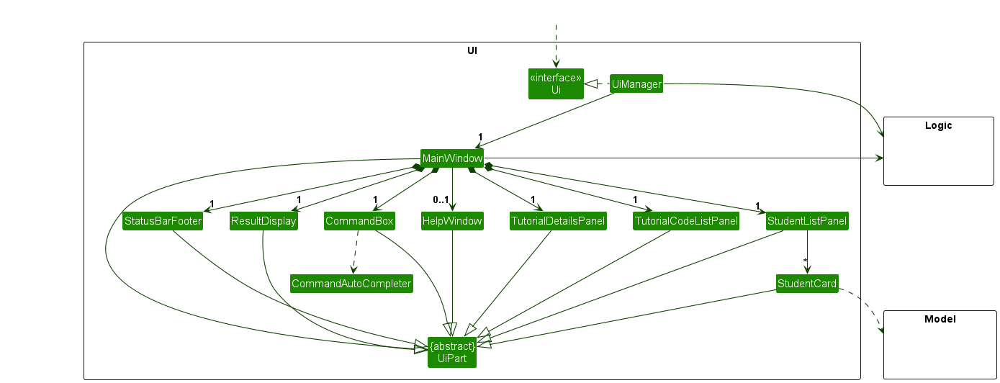

The UI consists of a `MainWindow` that is made up of parts e.g. `CommandBox`, `ResultDisplay`, `StudentListPanel`, `TutorialCodeListPanel`, `TutorialDetailsPanel`, `StatusBarFooter` etc.. All these, including the `MainWindow`, inherit from the abstract `UiPart` class which captures the commonalities between classes that represent parts of the visible GUI.

The `UI` component uses the JavaFx UI framework. The layout of these UI parts are defined in matching `.fxml` files that are in the `src/main/resources/view` folder. For example, the layout of the [`MainWindow`](https://github.com/AY2526S2-CS2103T-W13-4/tp/tree/master/src/main/java/seedu/coursepilot/ui/MainWindow.java) is specified in [`MainWindow.fxml`](https://github.com/AY2526S2-CS2103T-W13-4/tp/tree/master/src/main/resources/view/MainWindow.fxml).

The `UI` component,

* executes user commands using the `Logic` component.
* listens for changes to `Model` data so that the UI can be updated with the modified data.
* keeps a reference to the `Logic` component, because the `UI` relies on the `Logic` to execute commands.
* depends on some classes in the `Model` component, as it displays `Student` object residing in the `Model`.
* displays tutorial information across two panels, `TutorialCodeListPanel` shows the list of tutorial codes, and `TutorialDetailsPanel` shows the corresponding day, time slot, and capacity details.
* displays each student's enrolled tutorials via `StudentCard`, which cross references the tutorial list to show tutorial tags on each student entry.

### Logic component

**API** : [`Logic.java`](https://github.com/AY2526S2-CS2103T-W13-4/tp/tree/master/src/main/java/seedu/coursepilot/logic/Logic.java)

Here's a (partial) class diagram of the `Logic` component:

The sequence diagram below illustrates the interactions within the `Logic` component, taking `execute("delete -student 1")` API call as an example.

:information_source: **Note:** The lifeline for `DeleteCommandParser` should end at the destroy marker (X) but due to a limitation of PlantUML, the lifeline continues till the end of diagram.

How the `Logic` component works:

1. When `Logic` is called upon to execute a command, it is passed to an `CoursePilotParser` object which in turn creates a parser that matches the command (e.g., `DeleteCommandParser`) and uses it to parse the command.
1. This results in a `Command` object (more precisely, an object of one of its subclasses e.g., `DeleteCommand`) which is executed by the `LogicManager`.
1. The command can communicate with the `Model` when it is executed (e.g. to delete a student). 
   Note that although this is shown as a single step in the diagram above (for simplicity), in the code it can take several interactions (between the command object and the `Model`) to achieve.
1. The result of the command execution is encapsulated as a `CommandResult` object which is returned back from `Logic`.

Here are the other classes in `Logic` (omitted from the class diagram above) that are used for parsing a user command:

How the parsing works:
* When called upon to parse a user command, the `CoursePilotParser` class creates an `XYZCommandParser` (`XYZ` is a placeholder for the specific command name e.g., `AddCommandParser`) which uses the other classes shown above to parse the user command and create a `XYZCommand` object (e.g., `AddCommand`) which the `CoursePilotParser` returns back as a `Command` object.
* All `XYZCommandParser` classes (e.g., `AddCommandParser`, `DeleteCommandParser`, ...) inherit from the `Parser` interface so that they can be treated similarly where possible e.g, during testing.

### Model component
**API** : [`Model.java`](https://github.com/AY2526S2-CS2103T-W13-4/tp/tree/master/src/main/java/seedu/coursepilot/model/Model.java)

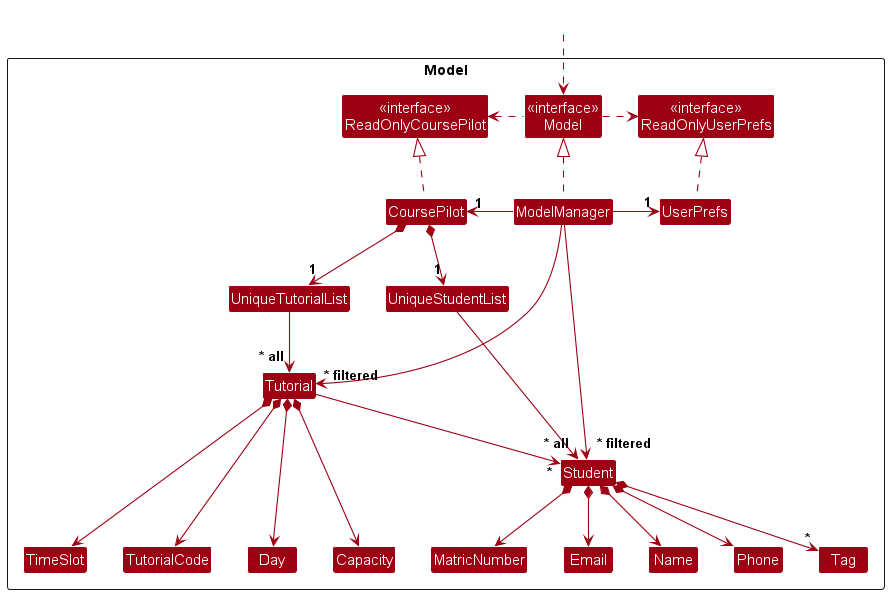

The `Model` component,

* stores CoursePilot data i.e., all `Student` objects (which are contained in a `UniqueStudentList` object).
* stores tutorial data i.e., all `Tutorial` objects (which are contained in a `UniqueTutorialList` object).
* stores the currently 'selected' `Student` objects (e.g., results of a search query) as a separate _filtered_ list which is exposed to outsiders as an unmodifiable `ObservableList<Student>` that can be 'observed' e.g. the UI can be bound to this list so that the UI automatically updates when the data in the list change.
* stores the currently selected `Tutorial` as the **current operating tutorial**, exposed as a JavaFX `ObjectProperty<Tutorial>` so the UI can reactively update when the selection changes.
* stores the currently filtered tutorial list as an unmodifiable `ObservableList<Tutorial>` for UI binding and tutorial operations.
* stores a `UserPrefs` object that represents the user’s preferences. This is exposed to the outside as a `ReadOnlyUserPrefs` object.
* does not depend on any of the other three components (as the `Model` represents data entities of the domain, they should make sense on their own without depending on other components)

:information_source: **Note:** An alternative (arguably, a more OOP) model is given below. It has a `Tag` list in the `CoursePilot`, which `Student` references. This allows `CoursePilot` to only require one `Tag` object per unique tag, instead of each `Student` needing their own `Tag` objects. 

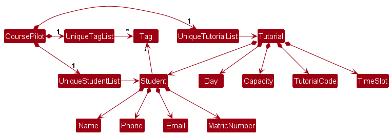

### Storage component

**API** : [`Storage.java`](https://github.com/AY2526S2-CS2103T-W13-4/tp/tree/master/src/main/java/seedu/coursepilot/storage/Storage.java)

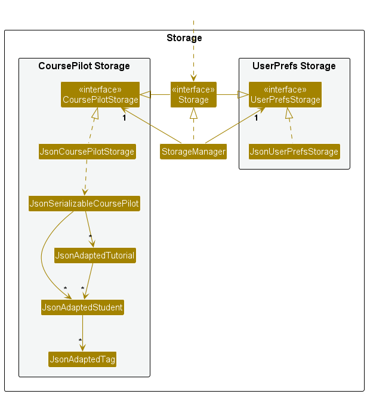

The `Storage` component,
* can save both CoursePilot data and user preference data in JSON format, and read them back into corresponding objects.
* inherits from both `CoursePilotStorage` and `UserPrefStorage`, which means it can be treated as either one (if only the functionality of only one is needed).
* depends on some classes in the `Model` component (because the `Storage` component's job is to save/retrieve objects that belong to the `Model`)

### Common classes

Classes used by multiple components are in the `seedu.coursepilot.commons` package.

--------------------------------------------------------------------------------------------------------------------

## **Implementation**

This section describes some noteworthy details on how certain features are implemented.

### Command Autocomplete feature

#### Implementation

The command autocomplete feature provides context-aware suggestions as the user types in the command box. It is implemented using `CommandAutoCompleter` in the Logic component, integrated with `CommandBox` in the UI component via a JavaFX `Popup` containing a `ListView`.

The class diagram below shows the key classes involved:

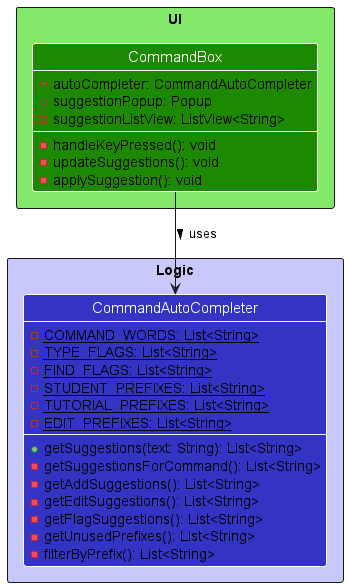

`CommandBox` holds a reference to `CommandAutoCompleter` and a `Popup` with a `ListView` for displaying suggestions. Whenever the text in the command box changes, `CommandBox` calls `CommandAutoCompleter#getSuggestions()` and renders the results in the popup dropdown.

The following sequence diagram illustrates the interaction when a user types `add ` and then selects a suggestion:

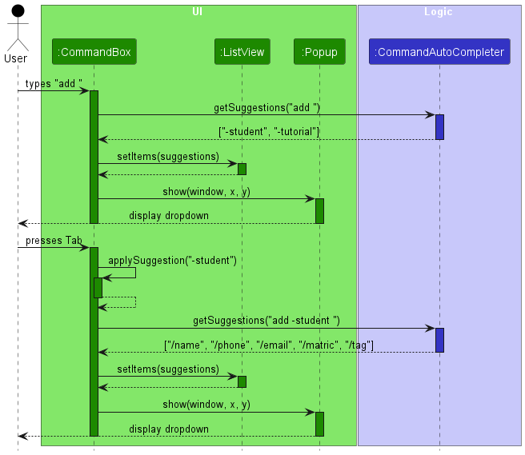

The autocomplete logic follows a state-based approach depending on how much of the command has been typed. The activity diagram below summarizes the top-level suggestion flow:

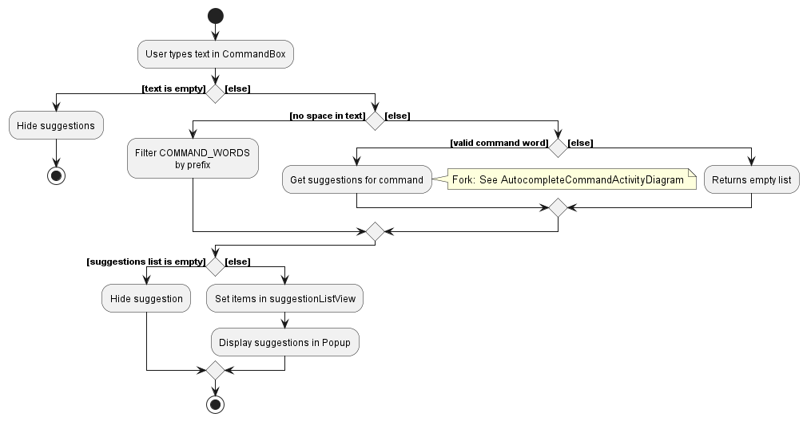

When the input contains a valid command word, the `Get suggestions for command` activity dispatches to command-specific logic, shown below:

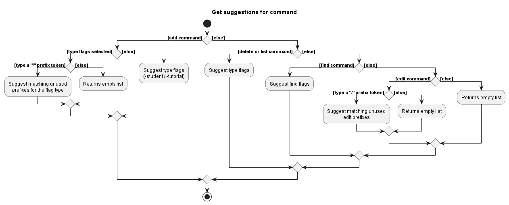

The suggestion states are:
1. **Command word completion** — when no space has been typed, filter matching command words (e.g. `a` → `add`).
2. **Flag suggestion** — after a command word like `add`, `delete`, or `find`, suggest the appropriate flags (e.g. `-student`, `-tutorial`).
3. **Prefix suggestion** — after a flag is selected, suggest unused prefixes for that context (e.g. `/name`, `/phone`). The `/tag` prefix is always suggested since it can be repeated.

Users interact with suggestions via:
- **Tab** — applies the currently highlighted suggestion
- **Enter** — applies the currently highlighted suggestion
- **Click** — applies the clicked suggestion
- **Escape** — dismisses the suggestion menu

#### Design considerations

**Aspect: Where to place the autocomplete logic**

* **Alternative 1 (current choice):** Separate `CommandAutoCompleter` class in the Logic package.
  * Pros: Clean separation of concerns; easy to unit test independently.
  * Cons: Duplicates some knowledge of command syntax that also exists in parsers.

* **Alternative 2:** Embed autocomplete logic directly in `CommandBox`.
  * Pros: Simpler, fewer classes.
  * Cons: Mixes UI and logic concerns; harder to test without a UI framework.

### \[Proposed\] Undo/redo feature

#### Proposed Implementation

The proposed undo/redo mechanism is facilitated by `VersionedCoursePilot`. It extends `CoursePilot` with an undo/redo history, stored internally as an `coursePilotStateList` and `currentStatePointer`. Additionally, it implements the following operations:

* `VersionedCoursePilot#commit()` — Saves the current CoursePilot state in its history.
* `VersionedCoursePilot#undo()` — Restores the previous CoursePilot state from its history.
* `VersionedCoursePilot#redo()` — Restores a previously undone CoursePilot state from its history.

These operations are exposed in the `Model` interface as `Model#commitCoursePilot()`, `Model#undoCoursePilot()` and `Model#redoCoursePilot()` respectively.

Given below is an example usage scenario and how the undo/redo mechanism behaves at each step.

Step 1. The user launches the application for the first time. The `VersionedCoursePilot` will be initialized with the initial CoursePilot state, and the `currentStatePointer` pointing to that single CoursePilot state.

Step 2. The user executes `delete -student 5` command to delete the 5th student in the currently selected tutorial. The `delete` command calls `Model#commitCoursePilot()`, causing the modified state of the CoursePilot after the `delete -student 5` command executes to be saved in the `coursePilotStateList`, and the `currentStatePointer` is shifted to the newly inserted CoursePilot state.

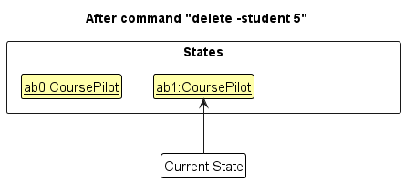

Step 3. The user executes `add -student /name David Tan /phone 90001234 /email david@example.com /matric A123450` to add a new student. The `add` command also calls `Model#commitCoursePilot()`, causing another modified CoursePilot state to be saved into the `coursePilotStateList`.

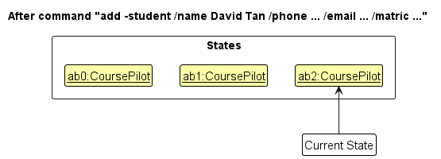

:information_source: **Note:** If a command fails its execution, it will not call `Model#commitCoursePilot()`, so the CoursePilot state will not be saved into the `coursePilotStateList`.

Step 4. The user now decides that adding the student was a mistake, and decides to undo that action by executing the `undo` command. The `undo` command will call `Model#undoCoursePilot()`, which will shift the `currentStatePointer` once to the left, pointing it to the previous CoursePilot state, and restores CoursePilot to that state.

:information_source: **Note:** If the `currentStatePointer` is at index 0, pointing to the initial CoursePilot state, then there are no previous CoursePilot states to restore. The `undo` command uses `Model#canUndoCoursePilot()` to check if this is the case. If so, it will return an error to the user rather
than attempting to perform the undo.

The following sequence diagram shows how an undo operation goes through the `Logic` component:

:information_source: **Note:** The lifeline for `UndoCommand` should end at the destroy marker (X) but due to a limitation of PlantUML, the lifeline reaches the end of diagram.

Similarly, how an undo operation goes through the `Model` component is shown below:

The `redo` command does the opposite — it calls `Model#redoCoursePilot()`, which shifts the `currentStatePointer` once to the right, pointing to the previously undone state, and restores CoursePilot to that state.

:information_source: **Note:** If the `currentStatePointer` is at index `coursePilotStateList.size() - 1`, pointing to the latest CoursePilot state, then there are no undone CoursePilot states to restore. The `redo` command uses `Model#canRedoCoursePilot()` to check if this is the case. If so, it will return an error to the user rather than attempting to perform the redo.

Step 5. The user then decides to execute the command `list`. Commands that do not modify CoursePilot, such as `list`, will usually not call `Model#commitCoursePilot()`, `Model#undoCoursePilot()` or `Model#redoCoursePilot()`. Thus, the `coursePilotStateList` remains unchanged.

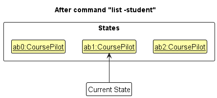

Step 6. The user executes `clear`, which calls `Model#commitCoursePilot()`. Since the `currentStatePointer` is not pointing at the end of the `coursePilotStateList`, all CoursePilot states after the `currentStatePointer` will be purged. Reason: It no longer makes sense to redo the previous `add -student ...` command. This is the behavior that most modern desktop applications follow.

The following activity diagram summarizes what happens when a user executes a new command:

#### Design considerations:

**Aspect: How undo & redo executes:**

* **Alternative 1 (current choice):** Saves the entire CoursePilot.
  * Pros: Easy to implement.
  * Cons: May have performance issues in terms of memory usage.

* **Alternative 2:** Individual command knows how to undo/redo by
  itself.
  * Pros: Will use less memory (e.g. for `delete`, just save the student being deleted).
  * Cons: We must ensure that the implementation of each individual command are correct.

Additional aspects and alternatives can be documented as the feature moves from proposed to implemented status.

### \[Proposed\] Data archiving

Data archiving is intended to support semester rollover while preserving historical records.
One possible approach is to introduce an `archive` command that moves inactive tutorials and their students into a separate archive data file while keeping the active file lean.
Implementation details are intentionally deferred until the feature scope is finalized.

--------------------------------------------------------------------------------------------------------------------

## **Documentation, logging, testing, configuration, dev-ops**

* [Documentation guide](Documentation.md)
* [Testing guide](Testing.md)
* [Logging guide](Logging.md)
* [Configuration guide](Configuration.md)
* [DevOps guide](DevOps.md)

--------------------------------------------------------------------------------------------------------------------

## **Appendix: Requirements**

### Product scope

**Target user profile**:

* University tutors or teaching assistants (TA) managing one or more tutorial groups
* TA who needs to track student participation, attendance, and grading progress across recurring weekly assessments
* TA who prefers local desktop apps over web-based platforms like Canvas
* Who can type fast and prefers typing to mouse interactions
* Who is reasonably comfortable using CLI apps

**Value proposition**: A lightweight, CLI-first desktop tool that gives Tutors and TAs a single hub to organize student groups and contacts across multiple tutorial slots, replacing scattered documents with fast, offline lookup and management, so sessions run consistently and administration overhead stays low

### User stories

Priorities: High (must have) - `* * *`, Medium (nice to have) - `* *`, Low (unlikely to have) - `*`

| Priority | As a ...  | I want to ...                                            | So that I can ... |
|----------|-----------|----------------------------------------------------------|-------------------|
| * * *    | New tutor using CoursePilot for the first time | Ask for help when using CoursePilot | I can refer to instructions when I forget how to use CoursePilot |
| * * *    | Tutor     | Add a student to CoursePilot                             | I can keep track of all my students in one place |
| * * *    | Tutor     | Delete a student from CoursePilot                        | I can remove students who are no longer relevant |
| * * *    | Tutor managing multiple students | List all student contacts         | I can quickly view all students stored in CoursePilot |
| * * *    | Tutor     | Edit existing student contact                            | I can keep student information accurate and up to date |
| * * *    | Tutor managing a large tutorial group | Find a student contact       | I can quickly find a specific student's information |
| * * *    | Tutor     | Clear all existing student contacts                      | I can reset the system when the data is no longer needed |
| * * *    | Tutor     | Exit CoursePilot                                         | I can safely close the application after use |
| * * *    | Tutor     | Archive CoursePilot data                                 | I do not have to repopulate all my data again |
| * * *    | Tutor managing multiple tutorials | List all tutorial slots          | I can check all the tutorials I am in charge of |
| * * *    | Tutor managing multiple tutorials | List all tutorial slots detail   | I can check all the details of the tutorials I am in charge of |
| * * *    | Tutor managing multiple tutorials | Select a tutorial slots          | I can choose a tutorial slot to operate on |
| * * *    | Tutor     | Assign students to certain tutorial slots                | I can organize students into the correct tutorials |
| * * *    | Tutor     | Add a tutorial slot                                      | I can create a new tutorial slot with a code, time, day and capacity |
| * * *    | Tutor     | Delete a tutorial slot                                   | I can remove tutorial slots that are no longer needed |
| * *      | Tutor managing multiple tutorials | Edit tutorial slots              | I can update tutorial arrangements |
| * *      | Tutor managing multiple tutorials | View which students are assigned to which tutorial slots | I can understand the distribution of students across tutorials |
| * *      | Tutor     | Mark student attendance                                  | I can record who attended each tutorial |
| * *      | Tutor     | Unmark student attendance                                | I can correct attendance records if mistakes occur |
| * *      | Tutor     | Track participation of each student                      | I can monitor student participation over time per tutorial slot |
| * *      | Tutor managing multiple tutorials | Filter available tutorial slots  | I can easily find tutorial slots that match my conditions |
| * *      | Tutor     | Provide feedback to students                             | I can help students improve their learning |
| * *      | Tutor with upcoming deadlines | Add deadlines                        | I can remind myself of important dates |
| * *      | Tutor with upcoming deadlines | Delete deadlines                     | I can remove deadlines that are no longer relevant |
| * *      | Tutor with upcoming deadlines | Edit deadlines                       | I can update deadlines if schedules change |
| * *      | Tutor with upcoming deadlines | Be reminded of deadlines             | I do not miss any important deadlines |
| *        | Tutor     | Add assessments                                          | I can manage student evaluations and grading components |
| *        | Tutor     | Delete assessments                                       | I can remove assessments that are no longer required |
| *        | Tutor     | Edit assessments                                         | I can update assessment details when necessary |
| *        | Tutor     | Grade assessments                                        | I can evaluate student performance |
| *        | Tutor     | Track assessments                                        | I can monitor students' assessments and results |
| *        | Tutor     | Comment on student's work                                | I can provide constructive feedback to improve their learning |
| *        | Tutor     | Add tutorial resources                                   | I can share useful materials with students |
| *        | Tutor     | Delete tutorial resources                                | I can remove outdated or unnecessary materials |
| *        | Tutor     | Edit tutorial resources                                  | I can replace or reupload outdated materials |
| *        | Tutor     | Create groups                                            | I can organize students for collaborative activities |
| *        | Tutor     | Send student private message                             | I can communicate directly with a specific student |
| *        | Tutor     | Send student group message                               | I can communicate important information to multiple students at once |

### Use cases

(For all use cases below, the **System** is `CoursePilot` and the **Actor** is the `tutor`, unless specified otherwise)

**Use case: UC01 - Ask for help**

**MSS**

1.  Tutor requests for help.
2.  CoursePilot opens a separate help window containing a link to the user guide and a summary of commands.

    Use case ends.

**Use case: UC02 - Select a tutorial**

**MSS**

1. Tutor requests to select a tutorial by providing a tutorial code.
2. CoursePilot finds the matching tutorial.
3. CoursePilot sets the tutorial as the current operating tutorial.
4. CoursePilot updates the student list to show only students in the selected tutorial and shows a success message.

   Use case ends.

**Extensions**

* 1a. The provided tutorial code does not match any existing tutorial.
    * 1a1. CoursePilot shows an error message and the current operating tutorial remains unchanged.

      Use case ends.

* 1b. Tutor uses `select none` instead of providing a tutorial code.
    * 1b1. CoursePilot clears the current operating tutorial.
    * 1b2. CoursePilot updates the student list to show all students in the system.

      Use case ends.

**Use case: UC03 - Add a student**

**MSS**

1. Tutor selects a tutorial (UC02).
2. Tutor requests to add a student by providing the required details (Name, Phone Number, Email, Matriculation Number).
3. CoursePilot validates the provided details.
4. CoursePilot adds the student to the selected tutorial and shows a success message.

   Use case ends.

**Extensions**

* 2a. Required fields are missing or the format is invalid.
    * 2a1. CoursePilot shows an error message indicating the invalid or missing fields.

      Use case ends.

* 3a. The phone number or email is already in use by another student.
    * 3a1. CoursePilot shows an error message indicating duplicate contact details.

      Use case ends.

* 3b. The student is already enrolled in the selected tutorial.
    * 3b1. CoursePilot shows an error message indicating a duplicate student.

      Use case ends.

* 3c. The selected tutorial is at full capacity.
    * 3c1. CoursePilot shows an error message indicating the tutorial is full.

      Use case ends.

**Use case: UC04 - Delete a student**

**MSS**

1. Tutor selects a tutorial (UC02).
2. Tutor requests to delete a student by specifying the index in the displayed student list.
3. CoursePilot removes the student from the current tutorial.
4. CoursePilot removes the student from the global student list if they are not enrolled in any other tutorial.
5. CoursePilot updates the display and shows a confirmation message.

   Use case ends.

**Extensions**

* 2a. The given index is invalid.
    * 2a1. CoursePilot shows an error message indicating an invalid index.

      Use case ends.

**Use case: UC05 - Edit a student**

**MSS**

1. Tutor requests to edit a student by specifying the index in the displayed list and the fields to update.
2. CoursePilot validates the new details.
3. CoursePilot updates the student's details across all tutorials they are enrolled in and updates the global student list.
4. CoursePilot updates the display and shows a confirmation message.

   Use case ends.

**Extensions**

* 1a. The given index is invalid.
    * 1a1. CoursePilot shows an error message indicating an invalid index.

      Use case ends.

* 1b. No fields to edit are provided.
    * 1b1. CoursePilot shows an error message indicating at least one field must be provided.

      Use case ends.

* 2a. The new details conflict with an existing student (duplicate matric number, phone, or email).
    * 2a1. CoursePilot shows an error message indicating duplicate details.

      Use case ends.

**Use case: UC06 - Add a tutorial**

**MSS**

1. Tutor requests to add a tutorial by providing the required details (Tutorial Code, Day, TimeSlot, Capacity).
2. CoursePilot validates the provided details.
3. CoursePilot adds the tutorial to the system and shows a success message.

   Use case ends.

**Extensions**

* 1a. Required fields are missing or the format is invalid.
    * 1a1. CoursePilot shows an error message indicating the invalid or missing fields.

      Use case ends.

* 2a. A tutorial with the same code already exists.
    * 2a1. CoursePilot shows an error message indicating a duplicate tutorial code.

      Use case ends.

**Use case: UC07 - Delete a tutorial**

**MSS**

1. Tutor requests to delete a tutorial by specifying its index in the displayed tutorial list.
2. CoursePilot removes the tutorial from the system.
3. CoursePilot removes the tutorial from all students enrolled in it.
4. CoursePilot removes any student from the global system who is no longer enrolled in any remaining tutorial.
5. CoursePilot updates the display and shows a confirmation message.

   Use case ends.

**Extensions**

* 1a. The given index is invalid.
    * 1a1. CoursePilot shows an error message indicating an invalid index.

      Use case ends.

* 2a. The tutorial removed is the current operating tutorial.
    * 2a1. CoursePilot clears the Operating Tutorial selection.
    * 2a2. CoursePilot resets the student list display to show all students globally.

      Use case resumes at step 3.

**Use case: UC08 - List students or tutorials**

**MSS**

1. Tutor selects a tutorial (UC02).
2. Tutor requests to list students using the `-student` mode.
3. CoursePilot displays all students enrolled in the current operating tutorial and shows a confirmation message.

   Use case ends.

**Extensions**

* 1a. Tutor requests to list tutorials instead using `-tutorial` mode.
    * 1a1. CoursePilot displays all registered tutorials and their details.

      Use case ends.

* 2a. No tutorial is currently selected.
    * 2a1. CoursePilot displays all students in the global system and shows a confirmation message.

      Use case ends.

**Use case: UC09 - Find students**

**MSS**

1. Tutor selects a tutorial (UC02).
2. Tutor requests to find students by entering a field `Prefix` flag (`/phone`, `/email`, `/matric`) first.
3. Tutor requests to find students by entering one or more keywords.
4. CoursePilot filters and displays students in the current operating tutorial whose names match any of the keywords.
5. CoursePilot shows the matching students and the total number of them found.

      Use case ends.

**Extensions**

* 2a. Tutor provides no `Prefix` flag.
    * 2a1. CoursePilot defaults to filtering students by name.

      Use case resumes from step 3.

* 2b. Tutor provides an invalid prefix.
    * 2b1. CoursePilot shows an error message listing the valid prefixes.

      Use case ends.

* 3a. No tutorial is currently selected.
    * 3a1. CoursePilot searches across all students in the global system instead.
    * 3a2. CoursePilot filters and displays students in the global student list whose names match any of the keywords.

      Use case resumes from step 4.

* 3b. No keywords are provided.
    * 3b1. CoursePilot shows an error message indicating keywords must be provided.

      Use case ends.

**Use case: UC10 - Clear all data**

**MSS**

1. Tutor requests to clear all data.
2. CoursePilot removes all students and tutorials from the system.
3. CoursePilot updates the display and shows a confirmation message.

   Use case ends.

### Non-Functional Requirements

1.  Should work on any _mainstream OS_ as long as it has Java `17` or above installed.
2.  Should work without requiring an installer.
3.  Should be packaged into a single JAR file not exceeding 100MB.
4.  Should not depend on any remote server.
5.  Should not require a Database Management System (DBMS).
6.  Should return search results within 2 second for 1000 stored students and 100 tutorial slots.
7.  All commands should execute and display results within 2 seconds for typical data sizes.
8.  Should launch and be ready to accept commands within 3 seconds under typical conditions.
9.  Data should be stored locally in a human-editable file format (e.g., JSON).
10. Should not lose any stored data when the application is closed normally via the `exit` commmand, and should persist data between sessions.
11. Existing data should remain intact even if a command fails due to invalid input.
12.  The GUI should work well for standard screen resolutions of 1920x1080 and higher at 100% and 125% scaling, and should be usable at 1280x720 and higher at 150% scaling.

### Glossary

* **Mainstream OS**: Windows, Linux, Unix, MacOS
* **GUI**: Graphical User Interface; the visual display of CoursePilot that shows tutorials, students, and command results.
* **CLI**: Command Line Interface; a text-based interface for interacting with CoursePilot
* **Tutor**: A university instructor or Teaching Assistant (TA) responsible for conducting tutorial sessions and managing student records.
* **Student Contact**: A stored entry in CoursePilot containing a student's information
* **Tutorial Slot**: A tutorial object defined by a code, time, day, and capacity, created and managed by a tutor in CoursePilot
* **Current Operating Tutorial**: The tutorial currently selected via the `select` command, which student-level commands operate on
* **Matric Number**: A unique student identifier following the format Axxxxxx.
* **Type**: A flag (`-student` or `-tutorial`) that specifies which entity type a command operates on
* **Prefix**: A field identifier starting with `/` used to specify parameters in commands (e.g. /name, /email)
* **Index**: A temporary 1-based position number shown in a displayed list, used to reference a specific student or tutorial in commands.
* **MSS**: Main Success Scenario; the most straightforward interaction for a given use case, assuming nothing goes wrong.
* **Global Student List**: The complete list of all students stored in CoursePilot across all tutorials.

--------------------------------------------------------------------------------------------------------------------

## **Appendix: Instructions for manual testing**

Given below are instructions to test the app manually.

:information_source: **Note:** These instructions only provide a starting point for testers to work on;
testers are expected to do more *exploratory* testing.

### Launch and shutdown

1. Initial launch

   1. Download the jar file and copy into an empty folder

  1. Double-click the jar file Expected: Shows the GUI with a set of sample students. The window size may not be optimum.

1. Saving window preferences

   1. Resize the window to an optimum size. Move the window to a different location. Close the window.

   1. Re-launch the app by double-clicking the jar file. 
       Expected: The most recent window size and location is retained.

1. Additional exploratory checks:

  1. Launch with missing `config.json` and verify defaults are recreated.

  1. Launch after moving the app folder and verify data path handling remains valid.

### Adding a student

1. Adding a student to a selected tutorial

   1. Prerequisites: Select a tutorial using the `select` command (e.g., `select CS2103T-W13`). Ensure the tutorial exists and is not at full capacity.

   1. Test case: `add -student /name John Doe /phone 98765432 /email johnd@example.com /matric A123456` 
      Expected: Student is added to the current operating tutorial. Details of the added student shown in the status message.

   1. Test case: `add -student /name John Doe /phone 98765432 /email johnd@example.com /matric A123456` (repeat the same command) 
      Expected: No student is added. Error message indicating duplicate student shown in the status message.

   1. Test case: `add -student /name John Doe /phone 98765432 /email johnd@example.com`(missing `/matric` field) 
      Expected: No student is added. Error message indicating invalid command format shown in the status message.

   1. Other incorrect add commands to try: `add -student`, `add -student /name`, `add -student /name John Doe /phone abc /email johnd@example.com /matric A123456` (non-numeric phone) 
      Expected: Similar to previous.

1. Adding a student without a selected tutorial

   1. Prerequisites: Ensure no tutorial is selected. Use `select none` if needed.

   1. Test case: `add -student /name John Doe /phone 98765432 /email johnd@example.com /matric A123456` 
      Expected: No student is added. Error message indicating no tutorial is selected shown in the status message.

1. Additional exploratory checks:

   1. Add a student who already exists in the global list to a different tutorial and verify no duplicate student record is created in the global list.

   1. Add a student with a phone number or email already used by another student and verify the appropriate duplicate contact detail error is shown.

   1. Add students until the tutorial reaches maximum capacity, then attempt to add one more and verify the capacity error is shown.

### Deleting a student

1. Deleting a student while all students are being shown

  1. Prerequisites: Select a tutorial and using the `select` command. Multiple students in the list.

  1. Test case: `delete -student 1` 
      Expected: First student is deleted from the list. Details of the deleted student shown in the status message. Timestamp in the status bar is updated.

  1. Test case: `delete -student 0` 
      Expected: No student is deleted. Error details shown in the status message. Status bar remains the same.

  1. Other incorrect delete commands to try: `delete -student`, `delete -student x`, `delete -student ...` (where index is larger than the list size) 
      Expected: Similar to previous.

1. Additional exploratory checks:

  1. Delete a student who appears in multiple tutorials and verify the student remains in the global list.

  1. Delete a student who appears only in the selected tutorial and verify the student is removed from the global list.

### Adding a tutorial

1. Adding a valid tutorial

   1. Prerequisites: None. A tutorial does not need to be selected.

   1. Test case: `add -tutorial /code CS2103T-W12 /day Wed /timeslot 10:00-11:00 /capacity 10` 
      Expected: Tutorial is added to the system. Details of the added tutorial shown in the status message. Tutorial appears in the tutorial list.

   1. Test case: `add -tutorial /code CS2103T-W12 /day Wed /timeslot 10:00-11:00 /capacity 10` (repeat the same command) 
      Expected: No tutorial is added. Error message indicating duplicate tutorial code shown in the status message.

   1. Test case: `add -tutorial /code CS2103T-W12 /day Wed /timeslot 10:00-11:00` (missing `/capacity` field) 
      Expected: No tutorial is added. Error message indicating invalid command format shown in the status message.

   1. Other incorrect add tutorial commands to try: `add -tutorial`, `add -tutorial /code CS2103T-W12 /day Monday /timeslot 10:00-11:00 /capacity 10` (invalid day format), `add -tutorial /code CS2103T-W12 /day Wed /timeslot 10:00 /capacity 10` (invalid timeslot format) 
      Expected: Similar to previous.

1. Additional exploratory checks:

   1. Add a tutorial with capacity 1, add a student to it, then attempt to add another student and verify the capacity error is shown.

   1. Add a tutorial with the same code but different casing (e.g., `cs2103t-w12`) and verify it is treated as a duplicate.

### Deleting a tutorial

1. Deleting a tutorial while the tutorial list is shown

   1. Prerequisites: Run `list -tutorial` to display all tutorials. At least one tutorial must exist.

   1. Test case: `delete -tutorial 1` 
      Expected: First tutorial is deleted from the list. Details of the deleted tutorial shown in the status message.

   1. Test case: `delete -tutorial 0` 
      Expected: No tutorial is deleted. Error message indicating invalid index shown in the status message.

   1. Other incorrect delete tutorial commands to try: `delete -tutorial`, `delete -tutorial x`, `delete -tutorial ...` (where index is larger than the list size) 
      Expected: Similar to previous.

1. Additional exploratory checks:

   1. Delete a tutorial containing students who are also enrolled in other tutorials and verify those students remain in the global list.

   1. Delete a tutorial containing students who are not enrolled in any other tutorial and verify those students are removed from the global list entirely.

   1. Delete the currently selected tutorial (current operating tutorial) and verify the operating tutorial selection is cleared.

### Saving data

1. Dealing with missing/corrupted data files

  1. Rename `data/coursepilot.json` to simulate a missing file, then launch the app. 
    Expected: App starts with sample data and recreates the data file after the next data-changing command.

  1. Corrupt `data/coursepilot.json` (e.g., remove a closing brace), then launch the app. 
    Expected: App starts with an empty CoursePilot and logs a data loading warning.

1. Additional exploratory checks:

  1. Perform a valid add/edit/delete command and verify `data/coursepilot.json` is updated.

  1. Make `data/coursepilot.json` read-only and verify save failure is surfaced to the user.
