**CoursePilot** is a **streamlined desktop application for managing student contacts for university tutors and TAs**, merging the lightning speed of a **Command Line Interface (CLI)** with the visual feedback of a **Graphical User Interface (GUI)**. Built for tutors managing any number of tutorial groups, it offers a fast, reliable way to keep all your student information in one central place that works even without an internet connection.

For those who can type fast, **CoursePilot** transforms student management into a "type-and-done" workflow, allowing you to organize, track, and retrieve student contacts across multiple modules with far greater precision and speed than traditional, click-heavy applications.

* Table of Contents
{:toc}

--------------------------------------------------------------------------------------------------------------------

## Quick start

1. Ensure you have Java `17` or above installed in your Computer.<br>
   **Mac users:** Ensure you have the precise JDK version prescribed [here](https://se-education.org/guides/tutorials/javaInstallationMac.html).

1. Download the latest `.jar` file from the project releases.

1. Copy the file to the folder you want to use as the _home folder_ for your CoursePilot.
   * **Note:** Do not place the file in a write-protected folder. CoursePilot needs to be able to write data files to the same folder where the `.jar` file is located. Placing it in a write-protected location will prevent the app from saving data correctly.

1. Open a command terminal, `cd` into the folder you placed the jar file in, and run the following command:
   ```
   java -jar coursepilot.jar
   ```
   > **Note:** Double-clicking the `.jar` file may not work on some systems. If nothing happens when you double-click, use the command above in a terminal instead.
 
   A GUI similar to the one below should appear within a few seconds. The app will contain some sample tutorials and students to help you get started.
 
   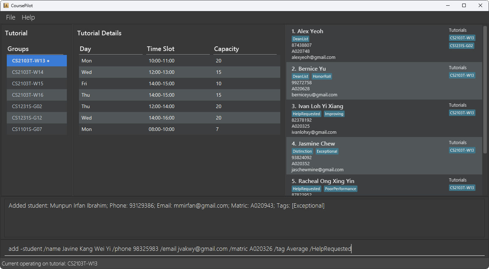

1. Type the command in the command box and press Enter to execute it. e.g. typing **`help`** and pressing Enter will open the help window.<br>
   Some example commands you can try:

   * `select CS2103T-W13` : Selects the tutorial `CS2103T-W13` as the current working tutorial.

   * `find Alex` : Finds all students in the selected tutorial who has "Alex" in their name.

   * `list -student` : Lists all students in the selected tutorial.

   * `add -student /name Micheal Jackson /phone 98765532 /email mjackson@example.com /matric A000006` : Adds a student named `Micheal Jackson` to the current tutorial.

   * `delete -student 3` : Deletes the 3rd student shown in the current tutorial's student list.

   * `exit` : Exits the app.

1. Refer to the [Features](#features) below for details of each command.

**Tip:** If you are new, start by using `list -tutorial` followed by `select` before attempting student-related commands.
This ensures commands like `add -student` and `list -student` work as expected.  
Following this workflow can help avoid common errors.

## Features

<div markdown="block" class="alert alert-info">

**:information_source: Notes about the command format:**<br>

* Words in `UPPER_CASE` are the parameters to be supplied by the user.<br>
  e.g. in `add -student /name NAME`, `NAME` is a parameter which can be used as `add -student /name John Doe`.

* Items in square brackets are optional.<br>
  e.g. `/name NAME [/tag TAG]` can be used as `/name John Doe /tag friend` or as `/name John Doe`.

* Items with `…`​ after them can be used multiple times including zero times.<br>
  e.g. `[/tag TAG]…​` can be used as ` ` (i.e. 0 times), `/tag friend`, `/tag friend /tag family` etc.

* Parameters can be in any order.<br>
  e.g. if the command specifies `/name NAME /phone PHONE_NUMBER`, `/phone PHONE_NUMBER /name NAME` is also acceptable.

* Extraneous parameters for commands that do not take in parameters (such as `help`, `exit` and `clear`) will be ignored.<br>
  e.g. if the command specifies `help 123`, it will be interpreted as `help`.

* If you are using a PDF version of this document, be careful when copying and pasting commands that span multiple lines as space characters surrounding line-breaks may be omitted when copied over to the application.

</div>

<div markdown="block" class="alert alert-info">

**:bulb: Tip: The Current Operating Tutorial**<br>

Many commands require you to first **select a tutorial** using the `select` command. The selected tutorial becomes your **current operating tutorial**. Commands that operate on students — `add -student`, `delete -student`, `list -student`, and `find` — all act within this tutorial. Use `select TUTORIAL_CODE` to set it. Use `select none` to clear it.

</div>

--------------------------------------------------------------------------------------------------------------------

### Viewing help : `help`

Shows a message explaining how to access the help page.

Format: `help`

* A pop-up window with a link to the User Guide will appear.
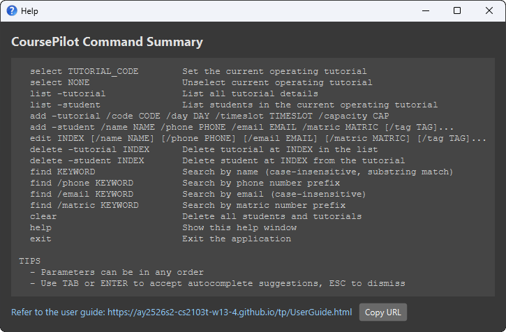

---

### Selecting a tutorial : `select`

Sets a tutorial as the **current operating tutorial**. Once selected, student-level commands (`add -student`, `delete -student`, `list -student`, `find`) will operate within this tutorial.

Format: `select TUTORIAL_CODE` or `select none`

* The `TUTORIAL_CODE` is case-insensitive.
* The tutorial code must exactly match a tutorial already in the system (e.g., `CS2103T-W13`).
* The tutorial remains active until you run another `select` command or `select none`.
* If the tutorial code is not found, an error message is shown and the current operating tutorial remains unchanged.
* Use `select none` to clear the current operating tutorial without selecting a new one.

Examples:
* `select CS2103T-W13` : Selects the tutorial with code `CS2103T-W13`.
* `select cs2103t-w13` : Also selects the same tutorial (case-insensitive).
* `select none` : Clears the current operating tutorial.
* `select INVALID` : No tutorial found with code: `INVALID`

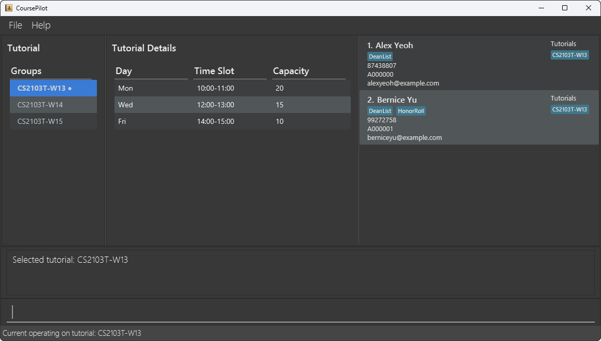

### Listing tutorials or students : `list`

Lists either the details of all available tutorials or all students in the currently selected tutorial.

Format: `list -tutorial` or `list -student`

**You must specify either `-tutorial` or `-student`.**

* `list -tutorial` : Shows all available tutorials details (day, time slot, capacity).
* `list -student` : Shows all students enrolled in the currently selected tutorial.
  * If a tutorial is selected, students in the **current operating tutorial** will be shown.
  * If no tutorial is selected, all students in the system will be shown.

Examples:
* `list -tutorial` : Displays all tutorials.
* `list -student` : Displays all students in the system.
* `select CS2103T-W13` followed by `list -student` : Displays all students in the CS2103T-W13 tutorial.

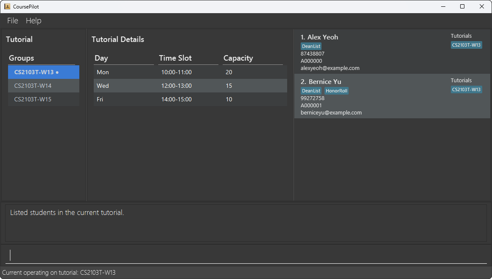

---

### Adding a student or tutorial : `add`

Adds a student to the **current operating tutorial**, or adds a new tutorial to the system.

#### Adding a student: `add -student`

Format: `add -student /name NAME /phone PHONE_NUMBER /email EMAIL /matric MATRICNUMBER [/tag TAG]…​`

* Requires a tutorial to be selected first.
* The fields (`/name`, `/phone`, `/email`, `/matric`) are mandatory.
* A student can have any number of tags (including 0).
* If the student does not yet exist in the system, they are also added to the global student list. If they already exist (matched by name or matric number), they are linked to the selected tutorial without creating a duplicate.
* A student cannot be added to the same tutorial twice.

**Field Constraints:**
* **Name**: Must contain only alphabetic characters and spaces. Cannot be blank. Maximum 100 characters long.
* **Phone**: Must contain only digits and be at least 3 digits long to a maximum of 15 digits long.
* **Email**: Must follow standard email format (e.g., `student@u.nus.edu`). Maximum 100 characters long.
* **Matric Number**: Must follow the format `Axxxxxx` where `x` is a digit (e.g., `A000000`, `A123456`). Must be exactly 7 characters: the letter `A` followed by 6 digits.
* **Tag**: Optional. Each tag must be a single alphanumeric word (no spaces or special characters). Maximum 30 characters long.

Examples:
* `add -student /name John Doe /phone 98765432 /email johnd@example.com /matric A000000`
* `add -student /name Betsy Crowe /tag friend /email betsycrowe@example.com /matric A000001 /phone 1234567 /tag student`
* `select CS2103T-W13` followed by `add -student /name David Li /phone 91031282 /email lidavid@example.com /matric A000003`

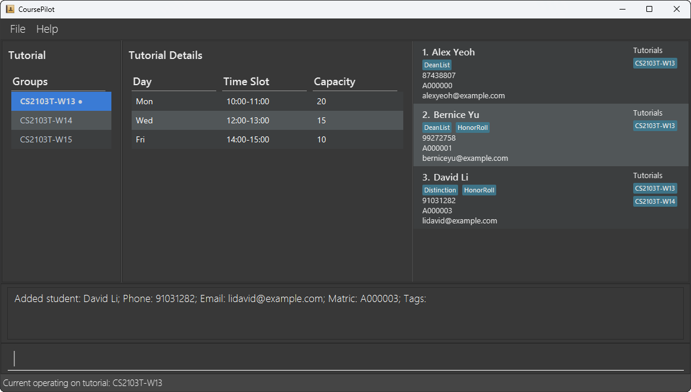

#### Adding a tutorial: `add -tutorial`

Format: `add -tutorial /code CODE /day DAY /timeslot TIMESLOT /capacity CAPACITY`

* All four fields are mandatory.
* Does not require a tutorial to be selected first.
* The tutorial code must be unique.

**Field Constraints:**
* **Code**: Must contain only alphanumeric characters, hyphens, and underscores. Cannot be blank. Maximum 20 characters long.
* **Day**: Must be one of: Mon, Tue, Wed, Thu, Fri, Sat, Sun (case-sensitive, first letter capitalised).
* **TimeSlot**: Must follow the format `XX:XX-XX:XX` where `X` is a digit (e.g., `13:00-14:00`). The start time must be before end time. Time is in 24-hour format.
* **Capacity**: Must be a positive whole number starting from 1 to 1000.

Examples:
* `add -tutorial /code CS2103T-T01 /day Thu /timeslot 10:00-11:00 /capacity 30`
* `add -tutorial /code CS2103T-W16 /day Thu /timeslot 14:00-15:00 /capacity 15`

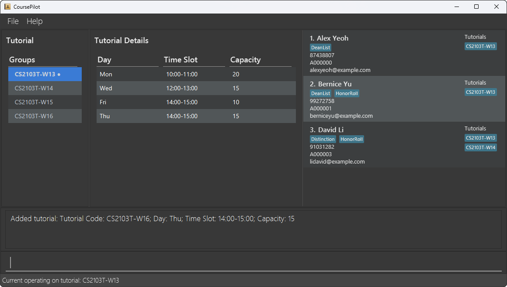

---

### Editing a student : `edit`

Edits an existing student's details.

Format: `edit INDEX [/name NAME] [/phone PHONE] [/email EMAIL] [/matric MATRICNUMBER] [/tag TAG]…​`

* Edits the student at the specified `INDEX`. The index refers to the index number shown in the **currently displayed student list**. The index **must be a positive integer** 1, 2, 3, …​
* At least one of the optional fields must be provided.
* Existing values will be updated to the input values.
* When editing tags, the existing tags of the student will be **replaced entirely** (not added to).
* You can remove all the student's tags by typing `/tag` without specifying any tag after it.
* The edit applies globally — it updates the student's details everywhere in the system.

Examples:
* `edit 1 /phone 91234567 /email johndoe@example.com` : Edits the phone number and email address of the 1st student.
* `edit 2 /name Betsy Crower /tag` : Edits the name of the 2nd student and clears all existing tags.
* `edit 3 /name David Li Hao Jun` : Edits the name of the 3rd student and leaves all existing tags untouched.

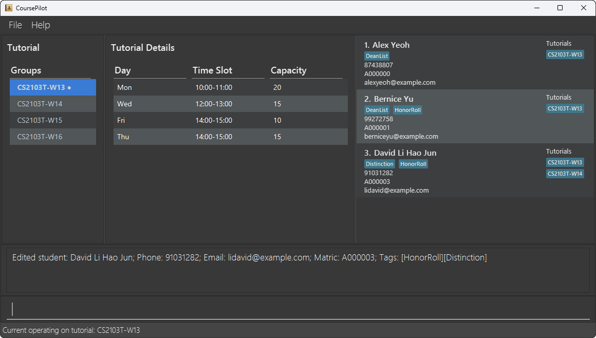

---

### Locating students : `find`

Finds and lists students in the currently selected tutorial who match the given search criteria.

Format: `find KEYWORD [MORE_KEYWORDS]…` or `find /phone KEYWORD` or `find /email KEYWORD` or `find /matric KEYWORD`

* **Name search (default)**: `find KEYWORD [MORE_KEYWORDS]` — returns students whose name contains any of the keywords as a substring. Case-insensitive.
* **Phone search**: `find /phone KEYWORD` — returns students whose phone number **starts with** any of the given keywords.
* **Email search**: `find /email KEYWORD` — returns students whose email address **contains** any of the given keywords. Case-insensitive.
* **Matric search**: `find /matric KEYWORD` — returns students whose matric number **starts with** any of the given keywords. Case-insensitive.
* When multiple keywords are provided, students matching **at least one** keyword are returned.
* If a tutorial has been selected, only students enrolled in the **current operating tutorial** are searched.
* If no tutorial is selected, the search is performed across all students in the system.

Examples:
* `find John` : Finds all students in the current tutorial whose name contains "John".
* `find alex david` : Returns students whose name contains "alex" or "david".
* `find /email u.nus.edu` : Finds all students whose email contains `u.nus.edu`.
* `find /matric A000` : Finds students whose matric number starts with `A000`.
* `find /phone 992` : Finds students whose phone number starts with `992`.

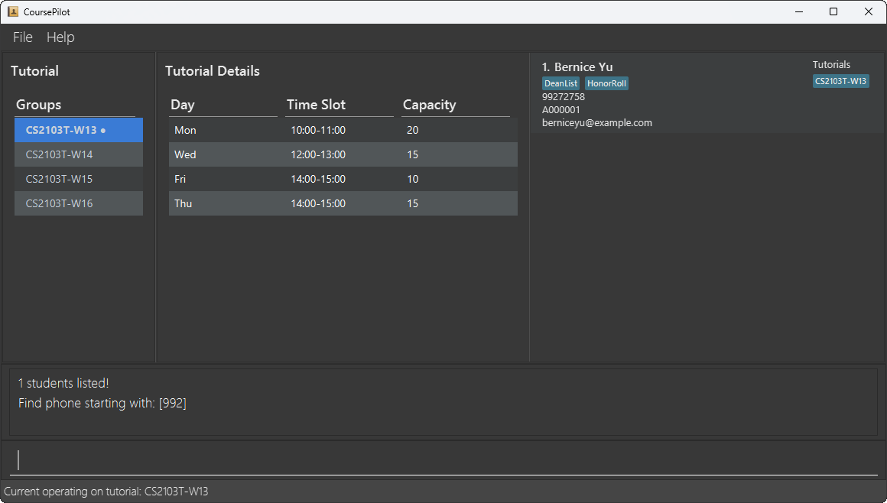

---

### Deleting a student or tutorial : `delete`

Deletes a student from the current tutorial, or deletes a tutorial from the system.

#### Deleting a student: `delete -student`

Format: `delete -student INDEX`

* Requires a tutorial to be selected first.
* `INDEX` refers to the position in the **current tutorial's student list**. The index **must be a positive integer** 1, 2, 3, …​
* The student is removed from the current tutorial.
* If the student is **not enrolled in any other tutorial**, they are also removed from the global student list entirely.
* If the student **is enrolled in another tutorial**, they remain in the system and in those other tutorials.

Examples:
* `find John` followed by `delete -student 1` : Deletes the 1st student in the results of the `find` command.
* `delete -student 2` : Deletes the 2nd student in the current tutorial.

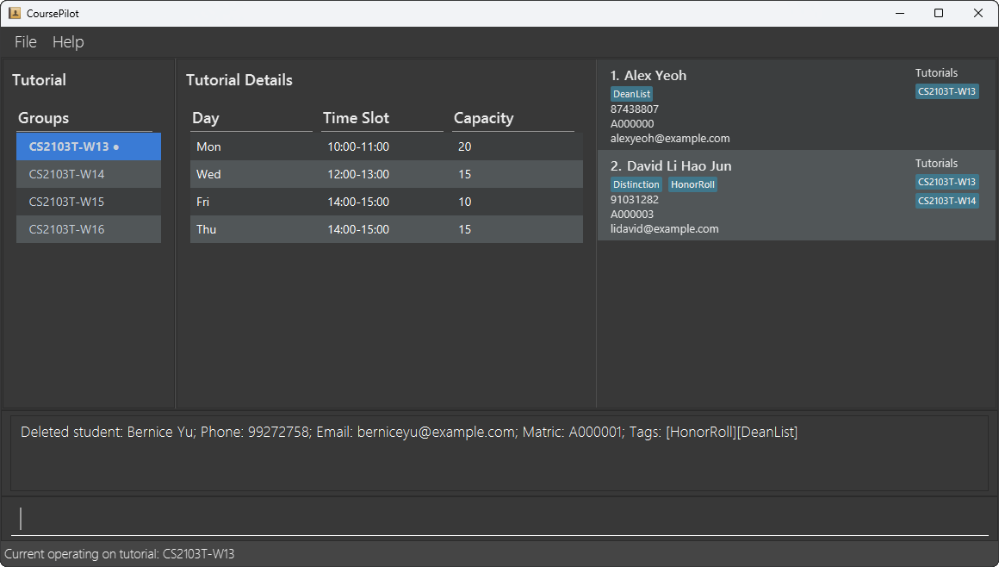

#### Deleting a tutorial: `delete -tutorial`

Format: `delete -tutorial INDEX`

* Does not require a tutorial to be selected first.
* `INDEX` refers to the position in the **displayed tutorial list**. The index **must be a positive integer** 1, 2, 3, …​
* The tutorial is removed from the system.
* Students who were enrolled in the deleted tutorial are **not** automatically removed from the global student list. They will remain in any other tutorials they are enrolled in.
* If the student is no longer enrolled in any other tutorial after this deletion, they will also be removed from the global student list entirely, as CoursePilot does not allow students to exist without being enrolled in at least one tutorial.

Examples:
* `delete -tutorial 2` : Deletes the 2nd tutorial in the list.

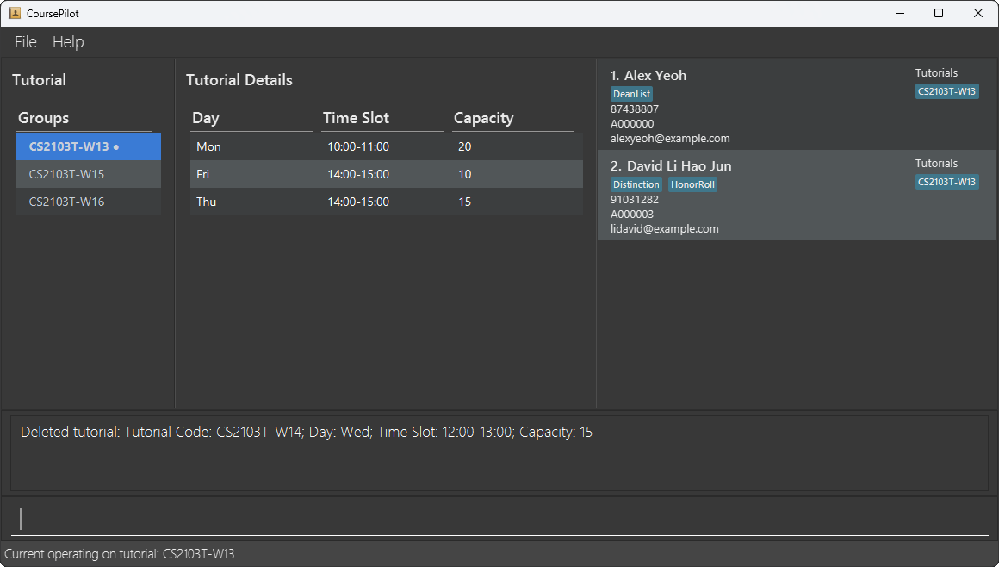

---

### Clearing all entries : `clear`

Clears **all students and all tutorials** from the system.

Format: `clear`

* Running `clear` will also reset the current operating tutorial selection. You will need to use `select` again after clearing if you wish to perform student-level operations.

<div markdown="span" class="alert alert-warning">:exclamation: **Caution:**
This command permanently deletes all students and all tutorials. This action cannot be undone. Use with care.
</div>

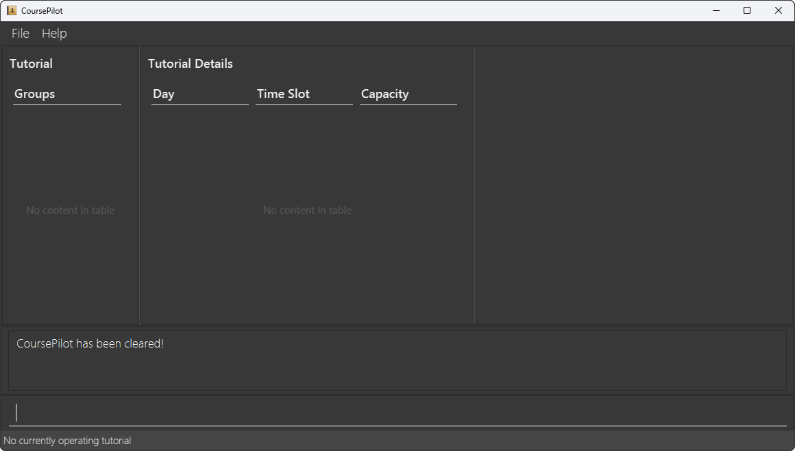

---

### Exiting the program : `exit`

Exits the program.

Format: `exit`

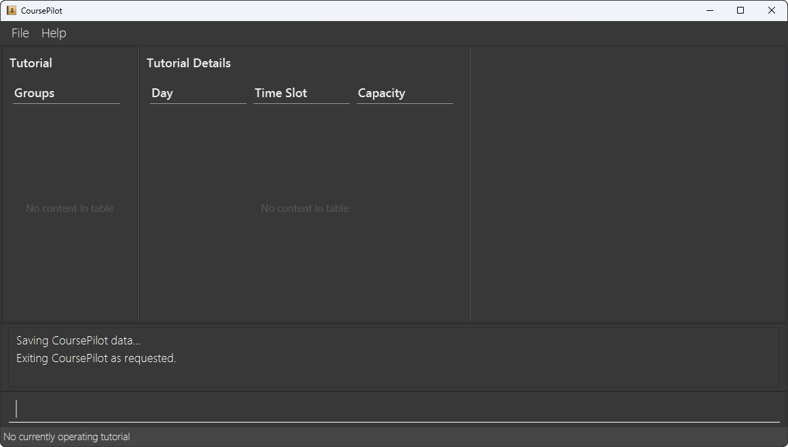

---

### Command Autocomplete

CoursePilot provides context-aware autocomplete suggestions as you type in the command box. Suggestions appear in a dropdown menu above the input field.

* **Command words**: Start typing and matching commands (e.g., `add`, `delete`, `list`) are suggested.
* **Flags**: After typing a command word, relevant flags are suggested (e.g., `-student`, `-tutorial` for `add`).
* **Prefixes**: After selecting a flag, the required parameter prefixes are suggested (e.g., `/name`, `/phone`, `/email`, `/matric` for `add -student`). Already-used prefixes are excluded from suggestions, except `/tag` which can be used multiple times.

**Keyboard shortcuts:**
* <kbd>Tab</kbd> : Accepts the selected suggestion.
* <kbd>Enter</kbd> : Accepts the selected suggestion.
* <kbd>Escape</kbd> : Dismisses the suggestion menu.
* You can also click on any suggestion to select it.

Autocomplete suggestions are updated dynamically as you type, helping to reduce input errors and improve efficiency.

### Saving the data

CoursePilot automatically saves all data after any command that modifies data. There is no need to save manually.

The data is saved in a JSON file located at `[JAR file location]/data/coursepilot.json`.

---

### Editing the data file

Advanced users can directly edit the data file to make bulk changes. The data file is stored as `[JAR file location]/data/coursepilot.json` in JSON format.

<div markdown="span" class="alert alert-warning">:exclamation: **Caution:**
If your changes to the data file make its format invalid, CoursePilot will discard all data and start with an empty data file on the next run. Ensure you make a backup before editing and thoroughly validate the JSON format after making changes.<br>
Furthermore, manual edits can cause CoursePilot to behave unexpectedly if invalid data is introduced. Only edit the data file if you are confident in your ability to maintain valid JSON structure and data constraints.
</div>

## FAQ

**Q**: How do I transfer my data to another computer?<br>
**A**: Install CoursePilot on the other computer and overwrite the empty data file it creates with the `coursepilot.json` file from your previous installation.

**Q**: What happens if I forget to select a tutorial before using write operations like `add -student` or `delete -student`?<br>
**A**: CoursePilot will display an error message: "No current operating tutorial selected. Use select first." Use the `select` command to choose a tutorial before retrying.
* Running `clear` will also reset the current operating tutorial selection. You will need to use `select` again after clearing if you wish to perform student-level operations.
**Q**: Can I add a student without selecting a tutorial first?<br>
**A**: No. Students must be added to a tutorial using `add -student` while a tutorial is selected. Use `select TUTORIAL_CODE` first, then `add -student`. This ensures every student is organised under a tutorial from the moment they are added.

**Q**: What happens to a student's data when I delete them from a tutorial?<br>
**A**: If the student is enrolled in other tutorials, they remain in the system. If the deleted tutorial was their only one, they are removed from the global student list as well.

**Q**: Does deleting a tutorial delete its students?<br>
**A**: No. Deleting a tutorial removes the tutorial itself, but all students who were in that tutorial remain in the global student list.

**Q**: What should I do if I enter an invalid command?<br>
**A**: CoursePilot will display an error message indicating what went wrong. Use the `help` command to view the correct command format.

**Q**: When should I use `select none`?<br>
**A**: Use `select none` when you want to stop working within a specific tutorial without selecting a new one. This clears the current operating tutorial, and student-level commands like `add -student` and `delete -student` will no longer be available until you select a tutorial again. It is useful when you want to use `list -student` or `find` to search across all students in the system.

## Known issues

1. **When using multiple screens**, if you move the application to a secondary screen, and later switch to using only the primary screen, the GUI will open off-screen. The remedy is to delete the `preferences.json` file created by the application before running the application again.
2. **If you minimize the Help Window** and then run the `help` command (or use the `Help` menu, or the keyboard shortcut `F1`) again, the original Help Window will remain minimized, and no new Help Window will appear. The remedy is to manually restore the minimized Help Window.

## Known limitations

1. **Duplicate phone numbers is not supported** in CoursePilot as we do not support country code prefixes. This means that if two students from different countries share the same number but have different country codes, one of them cannot be added. The suggested work around is to add the country code at the front, but CoursePilot will not help you differentiate between country codes and phone number.
2. **Matric number validation is intentionally flexible** as CoursePilot accepts matric numbers in the format of "A" followed by 6 digits (e.g. A123456) with no checksum validation. Since CoursePilot is designed for personal use, we trust tutors to be responsible for the accuracy of their own data and thus allow this flexibility.
3. **Tags do not support numbers or spaces** as tag names must be a single word containing only letters. This keeps tags concise and scannable at a glance, and multi-word descriptions are better captured in other fields such as the student's name.
4. **Searching by tag is not currently supported** and the `find` command only allows search by name, phone, email and matric number.
5. **Email validation is intentionally lenient** and accepts unconventional formats such as `11@11`. Since CoursePilot is designed for personal use, we trust tutors to enter accurate information without needing strict formatting rules that may inadvertently reject valid institutional email formats.
6. **Tutorial day must be entered in exact 3-letter format** and only accepts `Mon`, `Tue`, `Wed`, `Thu`, `Fri`, `Sat` or `Sun`. This standardised format ensures consistency across all tutorial entries and keeps the display clean and uniform.
7. **Tutorial timeslot must follow the HH:MM-HH:MM format** and must be entered in 24-hour time (e.g. `13:00-14:00`). This strict format ensures unambiguous parsing and consistent display across all tutorials.
8. **`list -tutorial` does not do anything visually** as CoursePilot does not have any commands that filter the tutorial list, meaning it will always show all tutorials. It is best used to simply refresh the tutorial details.
9. **Phone number and email address are required fields when adding a student** as CoursePilot is designed to serve as a contact book for tutors, making these fields central to its purpose. A student entry without contact details would defeat the core value of the application.

## Command summary

Action | Format, Examples
--------|------------------
**Add student** | `add -student /name NAME /phone PHONE_NUMBER /email EMAIL /matric MATRICNUMBER [/tag TAG]…​` <br> e.g., `add -student /name James Ho /phone 22224444 /email jamesho@example.com /matric A000000 /tag friend`
**Add tutorial** | `add -tutorial /code CODE /day DAY /timeslot TIMESLOT /capacity CAPACITY` <br> e.g., `add -tutorial /code CS2103T-W12 /day Wed /timeslot 10:00-11:00 /capacity 10`
**Clear** | `clear`
**Delete student** | `delete -student INDEX` <br> e.g., `delete -student 3`
**Delete tutorial** | `delete -tutorial INDEX` <br> e.g., `delete -tutorial 1`
**Edit** | `edit INDEX [/name NAME] [/phone PHONE_NUMBER] [/email EMAIL] [/matric MATRICNUMBER] [/tag TAG]…​` <br> e.g., `edit 2 /name James Lee /email jameslee@example.com`
**Find** | `find KEYWORD [MORE_KEYWORDS]…​` or `find /phone KEYWORD` or `find /email KEYWORD` or `find /matric KEYWORD` <br> e.g., `find James`, `find /email u.nus.edu`
**List students** | `list -student`
**List tutorials** | `list -tutorial`
**Select** | `select TUTORIAL_CODE` or `select none` <br> e.g., `select CS2103T-W12`, `select none`
**Help** | `help`
**Exit** | `exit`
